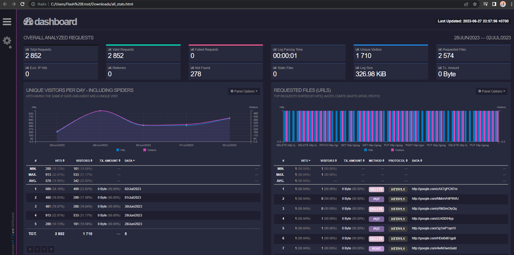
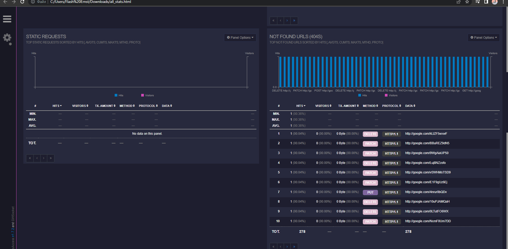
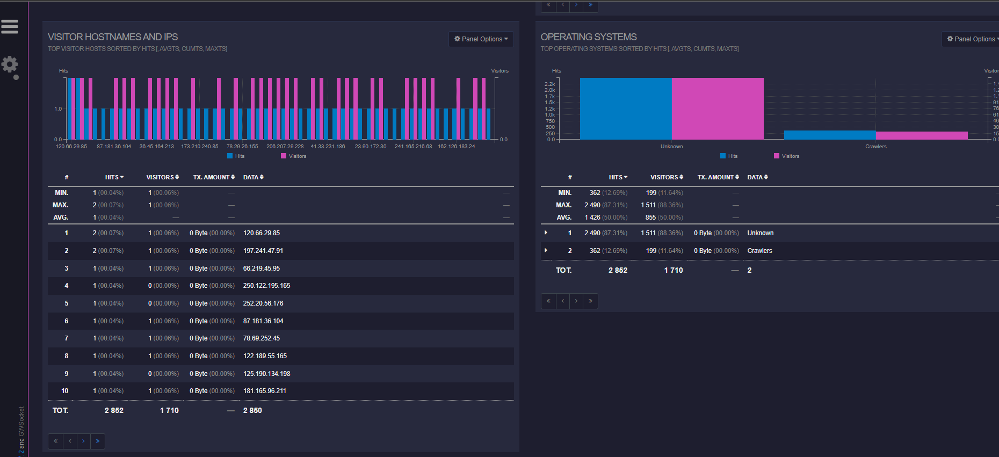
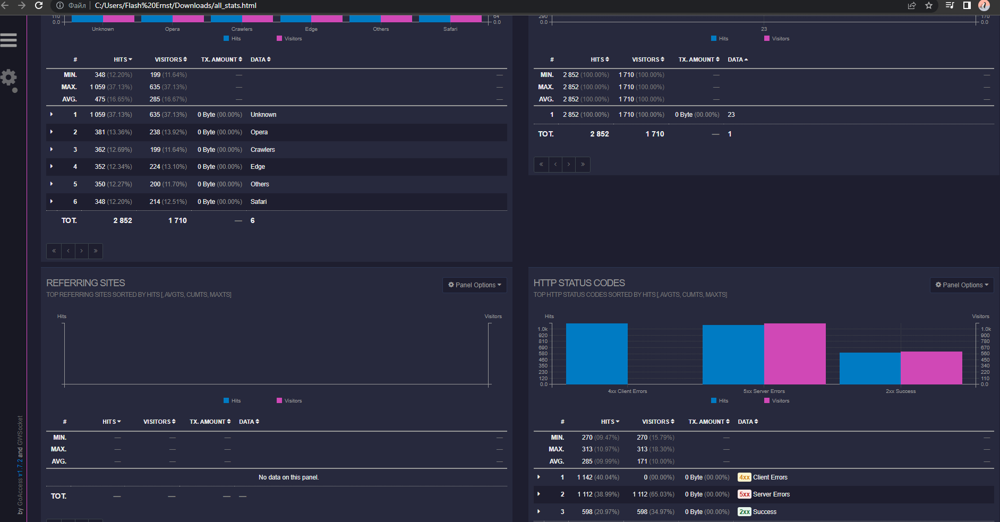

# GoAccess

## Install
#
### 1. *echo "deb http://deb.goaccess.io/ $(lsb_release -cs) main" | sudo tee -a /etc/apt/sources.list.d/goaccess.list*
### 2. *wget -O - https://deb.goaccess.io/gnugpg.key | sudo apt-key add -*
### 3. *sudo apt install goaccess*

## Get Log   
#
# Generate in terminal:

### - combined format: %h %^[%d:%t %^] "%r" %s %b
### - date: %d/%b/%Y
### - time: %H:%M:%S

# Generate html:

## sudo goaccess access*.log --log-format=COMBINED --real-time-html -o all_stats.html
#

