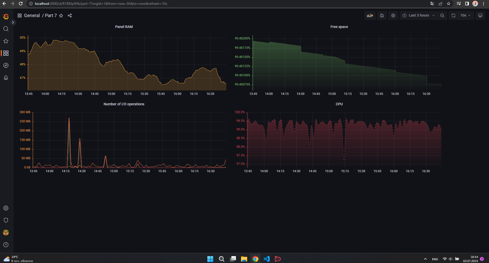
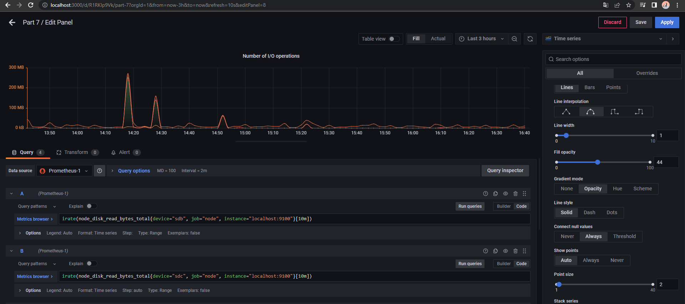
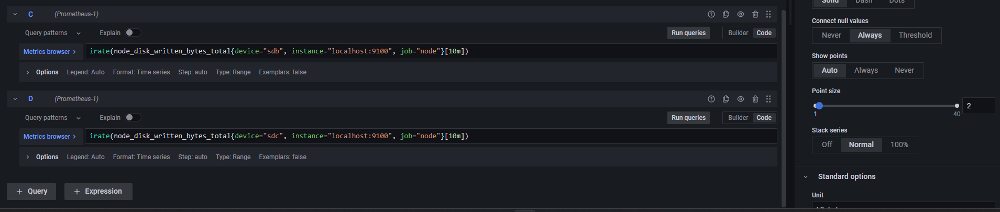
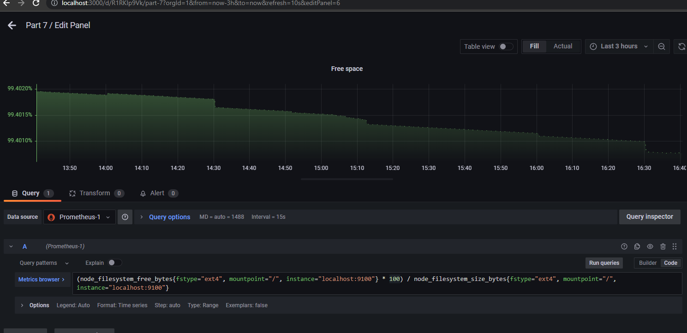
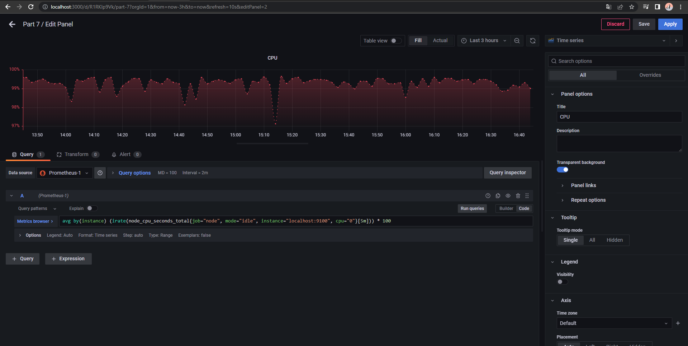

# Установка и настройка инструментов

## - https://jhooq.com/prometheous-grafan-setup/

# Grafana

## Если не получается установить графану из-за ограничений, можно этот вариант использовать 
- wget https://dl.grafana.com/oss/release/grafana_9.2.4_amd64.deb
- sudo dpkg -i grafana_9.2.4_amd64.deb && \ sudo systemctl enable grafana-server && sudo systemctl start grafana-server

# Немного про метрики 
### https://habr.com/ru/companies/tochka/articles/683608/
### https://habr.com/ru/companies/tochka/articles/685636/
### https://www.dmosk.ru/miniinstruktions.php?mini=prometheus-request

# Настройка дашборда

## RAM

## I/O Operations

## Free space

## CPU

# Нагрузка после выполенения команды stress(15:45-15:50)

# Нагрузка после выполнения part 1

